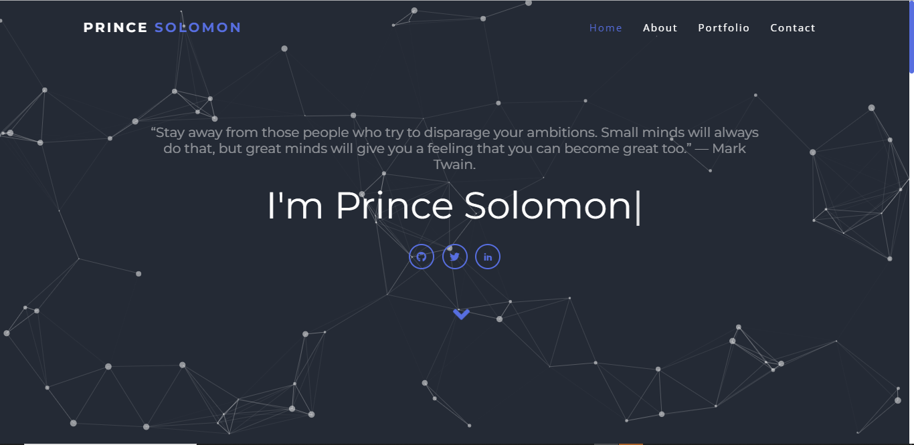

## Prince Solomon

	
   
  
  
  

### view the website here  

https://princexz.github.io/me/

### About Me

I am a Software Developer focused on building high-quality, thoughtful, and intuitive websites and web applications. I’m currently enrolled in a Full-stack Software development program remotely and studying through pair-programming with amazing folks all around the world at [ALX](https://www.alxafrica.com/)

As a software Engineer student at [ALX](https://www.alxafrica.com/), I've had the opportunity to work along-side professionals in notable projects. I value the ideas of hard-work and persistence. These values have aided my career as a developer and have shaped me into the person I am today.

I like to spend my free time adding on to my web stack and chasing my dream of becoming a full-time software engineer. Other than coding.

## 💻 Technologies used

## 👩‍💻 IDE used

### Social Media

[Github](https://github.com/princexz)
[Twitter](https://twitter.com/angelprince_me)
[Linkedin](https://www.linkedin.com/in/prinecxz/)

## Author: :black_nib:

* [Prince Solomon] [princexz](https://github.com/princexz)

## Acknowledgements :pray:
